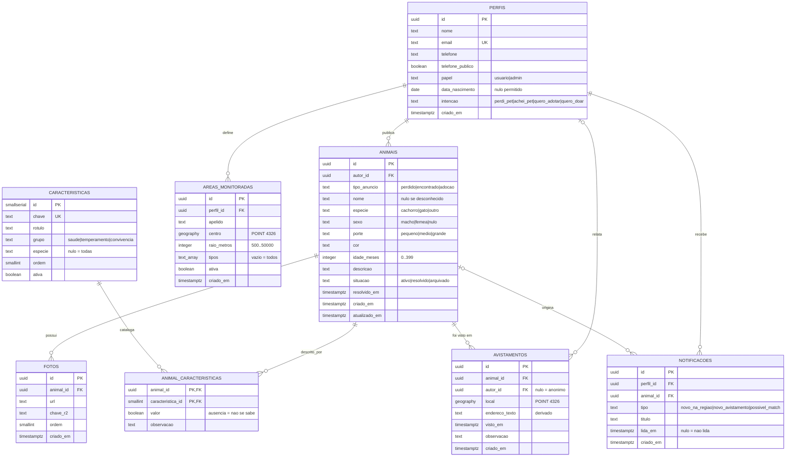

# 04 — Modelo de dados

O schema ainda não foi escrito. Enquanto isso, **este documento é a fonte da
verdade**: o `001_init.sql` será derivado dele.

A relação se inverte no momento em que a migration for escrita e aplicada —
a partir daí o SQL manda, e divergência aqui passa a ser defeito do
documento.

## Diagrama entidade-relacionamento

## Decisões de modelagem

### Os três fluxos em uma única tabela

`perdido`, `encontrado` e `adocao` compartilham quase todos os campos, e a
busca por região precisa varrer os três ao mesmo tempo. Três tabelas
separadas exigiriam `UNION` em toda consulta — a operação central do produto
ficaria mais cara e mais frágil. A diferença entre eles cabe numa coluna
com `CHECK`.

### Características em catálogo, mantido pelo administrador

O catálogo (`caracteristicas`) é cadastrado pelo **administrador**. Quem
publica um anúncio apenas **seleciona** entre as opções existentes — não
digita característica livre, não cria entrada nova.

Isso dá três coisas:

- **Vocabulário controlado.** "castrado", "Castrado", "ja castrou" seriam
  três valores distintos se o texto fosse livre, e o filtro por
  característica (RF-16) deixaria de funcionar.
- **Evolução sem migration.** Acrescentar "convive com gatos" é uma linha
  nova na tabela, feita pela interface administrativa (RN-19).
- **Tri-estado** (RN-18). A ausência de linha em `animal_caracteristicas`
  distingue "sabemos que não é castrado" de "ninguém informou" — distinção
  que importa em anúncio de animal encontrado, onde quem publica não conhece
  o animal.

Custo aceito: consultar característica exige `JOIN`. Filtrar por
característica é secundário; filtrar por região é o caso central.

> **Ao implementar.** Característica selecionada vira linha em
> `animal_caracteristicas` — nunca coluna em `animais`. Colunas como
> `castrado` ou `docil` na tabela `animais` contradizem o catálogo e quebram
> RN-19 e RN-20.
>
> O erro não aparece em tempo de compilação: SQL é string, e nenhum
> verificador confere nome de coluna. Só falha em execução.

### `GEOGRAPHY` em vez de duas colunas numéricas

`GEOGRAPHY(POINT, 4326)` trata a Terra como elipsoide, então `ST_Distance`
devolve metros reais sem fórmula de Haversine na aplicação. Com o índice
GIST, `ST_DWithin` usa o índice em vez de varrer a tabela (RNF-04).

Consequência: as queries convertem para lat/lng na leitura, via
`ST_Y(local::geometry)` e `ST_X(local::geometry)`.

### Avistamento separado do anúncio

O animal se move. Guardar um único local no anúncio perderia o rastro, que é
justamente o que ajuda o tutor a procurar na direção certa. O primeiro
avistamento é o local do desaparecimento; os seguintes são relatos de
terceiros (RN-12).

Consequência: a busca por raio usa o avistamento **mais recente**, obtido
via `LEFT JOIN LATERAL` (RN-14).

### Fotos no R2, referência no Postgres

O banco guarda `url` e `chave_r2`. O arquivo nunca entra no Postgres, e o
upload não passa pelo servidor (RNF-10).

`chave_r2` é guardado separado da `url` porque a exclusão do objeto no R2
precisa da chave, e derivá-la da URL seria frágil se o domínio público mudar.

### `perfis.papel` como coluna com `CHECK`

RN-33 define o administrador como atributo **persistente** do perfil, ao
contrário dos papéis de anúncio (RN-01), que são situacionais. Isso precisa
existir no schema: `papel TEXT NOT NULL DEFAULT 'usuario'` com
`CHECK (papel IN ('usuario', 'admin'))`.

Coluna com `CHECK` em vez de tabela de papéis porque são dois valores, e o
produto não prevê hierarquia nem permissão granular — ambas fora do escopo.
Uma tabela `papeis` com N-N seria estrutura para um problema que não temos.

`DEFAULT 'usuario'` mantém o cadastro comum como caminho natural: ninguém
vira administrador por omissão.

### `perfis.data_nascimento` e `perfis.intencao` (002_)

Duas colunas que o fluxo de cadastro do Figma pede e o `001` não tinha.
Ambas nascem `NULL`: os perfis criados antes da migration não as têm, e
exigir valor quebraria quem já entrou.

`data_nascimento` é `DATE`, não `TIMESTAMPTZ` — data de nascimento não tem
hora nem fuso, e guardar com fuso faria a data mudar conforme onde a pessoa
abre o aplicativo.

`intencao` é **preferência de quem se cadastrou**, não papel e não tipo de
anúncio. A mesma pessoa que chegou dizendo "quero adotar" publica um perdido
no mês seguinte: os papéis de anúncio continuam situacionais (RN-01), e esta
coluna não os limita. `quero_adotar` não tem par em `animais.tipo_anuncio` de
propósito — adotar é navegar, não publicar.

### `perfis.id` sem chave estrangeira para `auth.users`

O `id` espelha o id do usuário no provedor de autenticação, mas sem FK. Isso
mantém o schema portável caso o grupo troque o Supabase Auth por outra
solução — e permite rodar o `seed` sem provedor de autenticação nenhum.

---

## Decisões pendentes

### DP-01 — `animais.atualizado_em` não é atualizado

A coluna existe com `DEFAULT now()`, mas nada a atualiza — não há `TRIGGER`
nem `UPDATE` que a toque. Hoje ela é uma cópia de `criado_em`.

Decidir entre criar um trigger `BEFORE UPDATE` em migration futura, ou
remover a coluna. Manter como está é pior que as duas: dá a impressão de um
dado que não existe.

---

## Dicionário de dados

Domínios que valem em todas as tabelas:

| Convenção | Regra |
|---|---|
| Chave primária | `UUID` com `gen_random_uuid()`, exceto `perfis` (id externo) e `caracteristicas` (`SMALLSERIAL`) |
| Data e hora | Sempre `TIMESTAMPTZ`, nunca `TIMESTAMP` |
| Nomes | Sem acento, em minúsculas, com `_` |
| Enumeração | `TEXT` com `CHECK`, não tipo `ENUM` — alterar `ENUM` no Postgres é caro |
| Coordenada | `GEOGRAPHY(POINT, 4326)` |

## Índices

| Índice | Tabela | Serve a |
|---|---|---|
| `idx_animais_tipo` | `animais` | RF-09, RF-10 — parcial, só `situacao = 'ativo'` |
| `idx_animais_autor` | `animais` | anúncios de um perfil |
| `idx_avistamentos_local` | `avistamentos` | **GIST** — RF-11, RNF-04 |
| `idx_avistamentos_animal` | `avistamentos` | último avistamento (RN-14) |
| `idx_fotos_animal` | `fotos` | foto de capa |
| `idx_animal_carac_busca` | `animal_caracteristicas` | RF-16 |
| `idx_areas_centro` | `areas_monitoradas` | **GIST** parcial, só `ativa` — RF-24 |
| `idx_areas_perfil` | `areas_monitoradas` | áreas de um perfil |
| `idx_notificacoes_pendentes` | `notificacoes` | parcial, só não lidas — RF-25 |

## Evolução do schema

- Migration aplicada **nunca** é editada. Cria-se a próxima da sequência —
  alterar uma antiga quebra o banco de quem já aplicou
- Nenhuma alteração pelo painel do Supabase (RNF-09)
- Mudança de schema é coordenada pelo Responsável por Configuração — duas
  pessoas criando a mesma migration ao mesmo tempo gera conflito
- `npm run migrate` não roda no deploy; é executado manualmente
