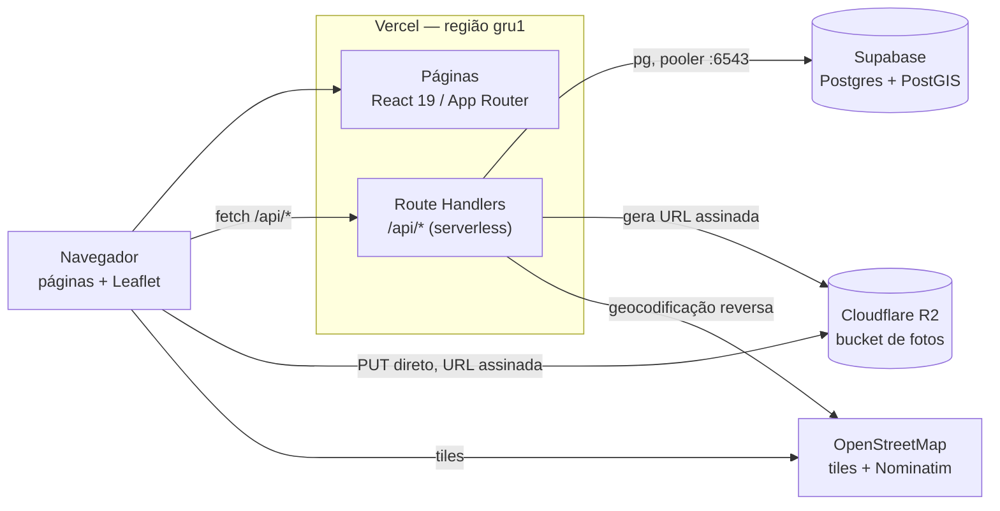

# 05 — Arquitetura e infraestrutura

Três serviços, um único deploy, todos em plano gratuito (RNF-01).

| Camada | Serviço | Plano | Observação |
|---|---|---|---|
| Aplicação (páginas + API) | **Vercel** | Hobby | Região `gru1` (São Paulo) |
| Banco de dados | **Supabase** Postgres | Free | Com PostGIS; conexão pelo pooler |
| Imagens | **Cloudflare R2** | Free | Upload direto do navegador |
| Versionamento e CI | **GitHub** | Free | Repositório público, preview por PR | 

## Visão geral

Não haverá servidor separado para a API. As Route Handlers viram funções
serverless na Vercel, no **mesmo domínio** das páginas. Por isso o front usa
caminhos relativos (`fetch("/api/animais")`) e não existe CORS entre front e
API.

A única fronteira com CORS é o `PUT` do navegador direto no R2, que exige
política de CORS configurada no bucket.

---

## Decisões técnicas

Identificador `DT-nn`. Decisão registrada aqui **não se rediscute** sem uma
nova decisão que a substitua explicitamente.

### DT-01 — Vercel para aplicação e API

Páginas e API no mesmo deploy, sem servidor próprio.

**Por quê.** Elimina CORS e uma segunda configuração de deploy. O preview
automático por pull request atende ao fluxo de revisão do grupo sem
configurar pipeline. Região `gru1` mantém a latência baixa no Brasil
(RNF-03), configurada em `vercel.json`.

**Descartados:** Fly.io, Koyeb e Render — exigiriam servidor separado,
Dockerfile e configuração de CORS. GitHub Actions para deploy — a Vercel já
observa o repositório; um pipeline próprio seria trabalho duplicado.

**Consequências.**
- Ambiente efêmero: nada de estado em memória entre requisições (RNF-07)
- Migrations não rodam no deploy; são manuais (`npm run migrate`)
- O plano Hobby é para uso não comercial

### DT-02 — Supabase Postgres com PostGIS

**Por quê.** A busca por raio é a operação central do produto (RF-11), e
depende de PostGIS. O Supabase oferece a extensão habilitada no plano
gratuito, sem configuração.

### DT-03 — Cloudflare R2 para as fotos

**Por quê.** O R2 fala o protocolo S3, então usamos `@aws-sdk/client-s3`
apontando para o endpoint da Cloudflare, com `region: "auto"`. O plano
gratuito não cobra egresso — relevante porque foto de anúncio é lida muitas
vezes e escrita uma só.

**Como funciona.** O arquivo **nunca passa pelo servidor** (RNF-10):

### DT-04 — Leaflet + OpenStreetMap, não Google Maps

**Por quê.** O Google Maps exige cartão de crédito mesmo na cota gratuita, o
que conflita com a restrição de custo zero (RNF-01, RNF-12). Leaflet e OSM
não exigem chave nem cadastro.

Geocodificação reversa pelo **Nominatim**, o serviço do próprio OSM.

**Consequências.**
- O Leaflet depende de `window`, então o componente do mapa carrega apenas no
  navegador (`ssr: false`)
- A política do Nominatim pede User-Agent identificando a aplicação e no
  máximo 1 requisição por segundo. Como só chamamos na criação de anúncio,
  ficamos abaixo do limite
- O endereço em texto é melhor esforço: se o Nominatim falhar, o anúncio é
  criado do mesmo jeito (RN-17)

### DT-05 — Notificação gravada no banco, não enviada

Sem e-mail e sem push. A notificação vive na tabela `notificacoes` e aparece
numa caixa dentro do app (RN-30).

**Por quê.** Decisão do grupo. Serviço de e-mail transacional gratuito impõe
limite de envio e exige verificação de domínio; push exige service worker e
permissão do navegador. Nenhum dos dois agrega ao que a disciplina avalia.

**Consequência.** E-mail ou push podem entrar numa iteração futura lendo
desta mesma tabela, sem mudança de schema.

---

## Variáveis de ambiente

Nenhuma credencial no repositório (RNF-02) — o repositório é público. Só o
`.env.example` é versionado, com os valores vazios.

| Variável | Origem | Usada em |
|---|---|---|
| `DATABASE_URL` | Supabase → pooler, porta 6543 | pool do Postgres, scripts de migration e seed |
| `R2_ACCOUNT_ID` | Cloudflare → ID da conta | cliente do R2 |
| `R2_ACCESS_KEY_ID` | Cloudflare → API token | cliente do R2 |
| `R2_SECRET_ACCESS_KEY` | Cloudflare → API token | cliente do R2 |
| `R2_BUCKET` | Nome do bucket | cliente do R2 |
| `R2_PUBLIC_URL` | URL pública do bucket (r2.dev) | cliente do R2 |

As mesmas variáveis precisam ser cadastradas no painel da Vercel — o build
falha sem elas se o pool for criado em escopo de módulo.

---

## Riscos da infraestrutura

Entradas para o registro de riscos, ainda não escrito.

| Risco | Efeito | Mitigação |
|---|---|---|
| Projeto Supabase pausa por inatividade | Aplicação fora do ar na apresentação | Acessar o banco na véspera; incluir no checklist de entrega |
| Uso da connection string direta em vez do pooler | `too many connections` sob carga, justo na demonstração | Registrado em DT-02; o `.env.example` traz a porta correta no comentário |
| CORS do bucket não aplicado | Upload falha só em produção | Versionar a política de CORS no repositório; acrescentar a URL de produção ao publicar |
| Cota gratuita estourada | Serviço suspenso | Volume de trabalho acadêmico está muito abaixo das cotas; conferir os limites vigentes antes da entrega |
| Migration esquecida no deploy | Schema desatualizado em produção | `npm run migrate` é manual e faz parte do procedimento de publicação |

## Documentos relacionados

- [01 — Visão do produto](01-visao-produto.md) — restrições do projeto
- [02 — Requisitos](02-requisitos.md) — RNF-01 a RNF-12
- [04 — Modelo de dados](04-modelo-dados.md) — schema e migrations
