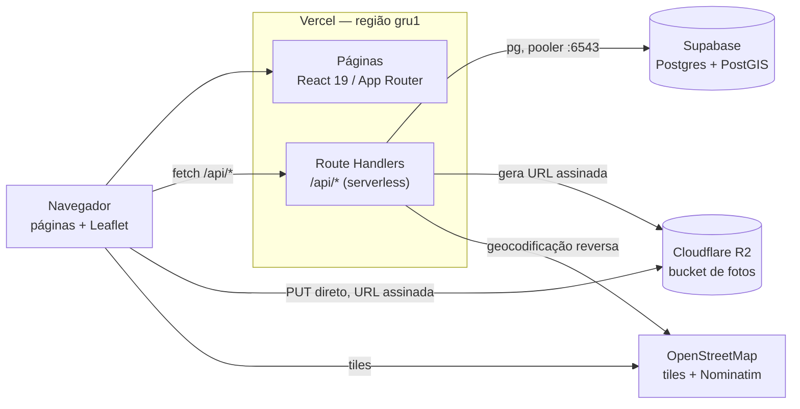
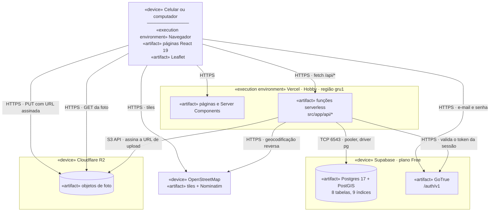
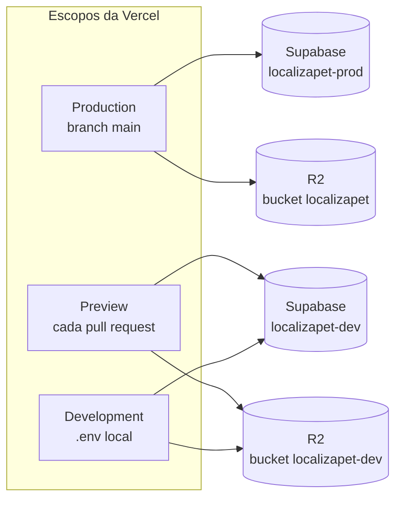

# 05 — Arquitetura e infraestrutura

Três serviços, um único deploy, todos em plano gratuito (RNF-01).

| Camada | Serviço | Plano | Observação |
|---|---|---|---|
| Aplicação (páginas + API) | **Vercel** | Hobby | Região `gru1` (São Paulo) |
| Banco de dados | **Supabase** Postgres | Free | Com PostGIS; conexão pelo pooler |
| Imagens | **Cloudflare R2** | Free | Upload direto do navegador |
| Versionamento e CI | **GitHub** | Free | Repositório público, preview por PR | 

## Visão geral

Não haverá servidor separado para a API. As Route Handlers viram funções
serverless na Vercel, no **mesmo domínio** das páginas. Por isso o front usa
caminhos relativos (`fetch("/api/animais")`) e não existe CORS entre front e
API.

A única fronteira com CORS é o `PUT` do navegador direto no R2, que exige
política de CORS configurada no bucket.

## Diagrama de implantação

Onde cada peça roda, e por qual protocolo elas se falam. Notação UML de
implantação: `«device»` é máquina, `«execution environment»` é o que hospeda
código, `«artifact»` é o que foi implantado.

Três coisas que o diagrama torna visíveis:

**A foto nunca passa pela Vercel.** A função só **assina** a URL; o `PUT` sai
do navegador direto para o R2 (RNF-10). É a única fronteira do sistema que
exige CORS, e por isso é a que mais quebra.

**Não há servidor de API separado.** As Route Handlers são artefatos do mesmo
deploy das páginas, no mesmo domínio — daí o front usar caminho relativo e
não existir CORS entre front e API (DT-01).

**O navegador fala com quatro nós diferentes.** Vercel, Supabase Auth, R2 e
OpenStreetMap. Cada um é um ponto de falha independente, e é por isso que o
painel de `/diagnostico` testa as peças em separado.

### Os dois ambientes sobre a mesma topologia

A topologia acima é uma só; o que muda é **para qual instância** cada escopo
da Vercel aponta (DT-06).

O que separa os ambientes é **só o valor da variável** — nunca um `if` no
código. A conta da Cloudflare e o token de API são os mesmos nos dois lados;
o que difere é o bucket.

**Consequência que custa caro esquecer:** migration é aplicada duas vezes, em
momentos diferentes — `npm run migrate` contra o dev antes do pull request, e
`npm run migrate:prod` contra a produção depois do merge. O runner imprime o
host antes de agir, justamente porque não há como desfazer a que foi no alvo
errado.

---

## Decisões técnicas

Identificador `DT-nn`. Decisão registrada aqui **não se rediscute** sem uma
nova decisão que a substitua explicitamente.

### DT-01 — Vercel para aplicação e API

Páginas e API no mesmo deploy, sem servidor próprio.

**Por quê.** Elimina CORS e uma segunda configuração de deploy. O preview
automático por pull request atende ao fluxo de revisão do grupo sem
configurar pipeline. Região `gru1` mantém a latência baixa no Brasil
(RNF-03), configurada em `vercel.json`.

**Descartados:** Fly.io, Koyeb e Render — exigiriam servidor separado,
Dockerfile e configuração de CORS. GitHub Actions para deploy — a Vercel já
observa o repositório; um pipeline próprio seria trabalho duplicado.

**Consequências.**
- Ambiente efêmero: nada de estado em memória entre requisições (RNF-07)
- Migrations não rodam no deploy; são manuais (`npm run migrate`)
- O plano Hobby é para uso não comercial

### DT-02 — Supabase Postgres com PostGIS

**Por quê.** A busca por raio é a operação central do produto (RF-11), e
depende de PostGIS. O Supabase oferece a extensão habilitada no plano
gratuito, sem configuração.

### DT-03 — Cloudflare R2 para as fotos

**Por quê.** O R2 fala o protocolo S3, então usamos `@aws-sdk/client-s3`
apontando para o endpoint da Cloudflare, com `region: "auto"`. O plano
gratuito não cobra egresso — relevante porque foto de anúncio é lida muitas
vezes e escrita uma só.

**Como funciona.** O arquivo **nunca passa pelo servidor** (RNF-10):

### DT-04 — Leaflet + OpenStreetMap, não Google Maps

**Por quê.** O Google Maps exige cartão de crédito mesmo na cota gratuita, o
que conflita com a restrição de custo zero (RNF-01, RNF-12). Leaflet e OSM
não exigem chave nem cadastro.

Geocodificação reversa pelo **Nominatim**, o serviço do próprio OSM.

**Consequências.**
- O Leaflet depende de `window`, então o componente do mapa carrega apenas no
  navegador (`ssr: false`)
- A política do Nominatim pede User-Agent identificando a aplicação e no
  máximo 1 requisição por segundo. Como só chamamos na criação de anúncio,
  ficamos abaixo do limite
- O endereço em texto é melhor esforço: se o Nominatim falhar, o anúncio é
  criado do mesmo jeito (RN-17)

### DT-05 — Notificação gravada no banco, não enviada

Sem e-mail e sem push. A notificação vive na tabela `notificacoes` e aparece
numa caixa dentro do app (RN-30).

**Por quê.** Decisão do grupo. Serviço de e-mail transacional gratuito impõe
limite de envio e exige verificação de domínio; push exige service worker e
permissão do navegador. Nenhum dos dois agrega ao que a disciplina avalia.

**Consequência.** E-mail ou push podem entrar numa iteração futura lendo
desta mesma tabela, sem mudança de schema.

### DT-06 — Dois ambientes, mesma tecnologia

Desenvolvimento e produção são **instâncias separadas dos mesmos serviços**:
um segundo projeto Supabase e um segundo bucket R2, nunca uma tecnologia
diferente dos dois lados.

| Escopo na Vercel | Banco | Bucket |
|---|---|---|
| `Production` (`main`) | projeto Supabase de produção | `localizapet` |
| `Preview` (cada PR) | projeto Supabase de desenvolvimento | `localizapet-dev` |
| Local (`.env`) | projeto Supabase de desenvolvimento | `localizapet-dev` |

**Por que separar.** As migrations não rodam no deploy (DT-01), são manuais.
Com um banco só, a primeira migration testada num pull request reescreveria
o banco no ar — sem aviso, porque nada no fluxo de deploy passa perto disso.

**Por que não trocar a tecnologia no local.** A tentação é o ambiente local
não falar com o R2 e gravar a foto em disco. Duas razões contra:

- O upload vai direto do navegador para o bucket por URL assinada (RNF-10), e
  o que falha nesse arranjo é a **política de CORS do bucket** — que não tem
  como dar errado contra um disco local. É o risco que já está registrado
  mais abaixo, e ele ficaria invisível até o dia do deploy da F-09
- Gravar em disco nem funcionaria em produção: função serverless tem sistema
  de arquivos somente leitura. Seria código a mais exercitando um caminho que
  a produção nunca usa

O mesmo vale para o banco: Postgres local por Homebrew roda offline, mas a
versão do PostGIS diverge e a conexão não passa pelo pooler, que é onde estão
os problemas que só aparecem sob carga (DT-02).

**Custo.** Zero. Bucket no R2 não é cobrado, só o armazenamento, e o plano
gratuito do Supabase permite mais de um projeto por organização.

**Consequências.**
- O que difere entre os ambientes é **só o valor da variável** — nunca um `if`
  no código
- Mudança de schema é aplicada duas vezes, em momentos diferentes:
  `npm run migrate` contra o dev antes do pull request, e contra a produção
  depois do merge. Quem esquece a segunda derruba a `main`
- O seed só roda contra o banco de desenvolvimento

### DT-07 — Supabase Auth como provedor de autenticação

Autenticação por e-mail e senha pelo **Supabase Auth**, o serviço que já vem
com o projeto de banco (DT-02). Encerra a decisão pendente que bloqueava a
F-03 e, por cascata, a F-04 e a F-08.

**Alternativa descartada:** sessão própria, com hash de senha em `perfis` e
cookie assinado. Era viável e sem dependência nova — o `node:crypto` já traz
`scrypt`. Foi descartada por esforço: escrever hash, sessão, expiração e
renovação corretamente custa mais que as 14 h previstas para a F-03, e essas
horas valem mais nas features que estavam bloqueadas atrás dela.

**Por que não custa nada.** Está incluído no plano gratuito já em uso. Não é
serviço novo, não é outra conta, não pede cartão (RNF-01).

**Independente do Data API.** O projeto foi criado com o Data API
desmarcado, e o Supabase Auth não depende dele — responde em `/auth/v1`,
separado do PostgREST. O acesso a dados continua sendo o driver `pg` pelo
pooler.

**Consequências.**
- `perfis.id` recebe o `id` do usuário em `auth.users`. Continua **sem chave
  estrangeira**, como já estava decidido em
  [04 — Modelo de dados](04-modelo-dados.md): é o que mantém o schema
  portável se esta decisão for revista, e o que permite o `seed` rodar sem
  provedor de autenticação nenhum
- A F-03 **não precisa de migration**. O perfil é criado pela aplicação logo
  após o cadastro, com o id devolvido pelo provedor
- Duas variáveis novas, `NEXT_PUBLIC_SUPABASE_URL` e
  `NEXT_PUBLIC_SUPABASE_ANON_KEY`. As duas são públicas por natureza — vão
  para o navegador. **Não confundir com a `service_role`**, que nunca entra
  no código nem no `.env.example`
- Cada ambiente usa o Auth do seu próprio projeto (DT-06): usuário criado no
  `localizapet-dev` não existe em produção

### DT-08 — Tailwind e componentização, mobile primeiro

**Substitui a decisão anterior de CSS puro.** O `CLAUDE.md` e o RNF-11
diziam "CSS puro, sem Tailwind, sem biblioteca de UI"; a partir daqui a
interface usa **Tailwind CSS v4**, com as fichas técnicas do Figma
declaradas em `@theme` no `globals.css`.

**Por quê.** As telas construídas com CSS puro divergiram do Figma, e o
motivo foi estrutural: sem as fichas técnicas amarradas ao código, cada tela
reinventava espaçamento e cor. Com `@theme`, `bg-primary` **é** o
`theme/primary` do Figma — a divergência passa a exigir esforço em vez de
acontecer sozinha.

**Continua valendo:** nenhuma biblioteca de componentes prontos. Os
componentes são do projeto, em `src/components/`, e o RNF-11 segue exigindo
interface em português e responsiva.

**Mobile primeiro, e isto não é preferência.** O Figma só tem o layout de
390 px. Escrever para desktop e adaptar para o celular produz uma tela que
funciona onde ninguém desenhou e falha onde o desenho existe. As regras de
desktop entram por `min-width` e ficam registradas em
[07 — Interface](07-interface.md).

**Assets saem do Figma pela exportação**, não são recriados à mão. Emoji no
lugar de ícone desenhado descarta trabalho de design.

**Consequências.**
- `globals.css` deixa de acumular classes por tela e passa a declarar só as
  fichas técnicas e o punhado de estilos que Tailwind não cobre
- Tela não escreve estilo: compõe componentes. Utilitário repetido em três
  telas é componente que falta
- Um documento novo, [07 — Interface](07-interface.md), passa a ser a fonte
  da verdade da interface, com as divergências conhecidas listadas

---

## Variáveis de ambiente

Nenhuma credencial no repositório (RNF-02) — o repositório é público. Só o
`.env.example` é versionado, com os valores vazios.

| Variável | Origem | Usada em |
|---|---|---|
| `DATABASE_URL` | Supabase → pooler, porta 6543 | pool do Postgres, scripts de migration e seed |
| `NEXT_PUBLIC_SUPABASE_URL` | Supabase → Project URL | cliente do Supabase Auth (DT-07) |
| `NEXT_PUBLIC_SUPABASE_ANON_KEY` | Supabase → chave `anon` | cliente do Supabase Auth (DT-07) |
| `R2_ACCOUNT_ID` | Cloudflare → ID da conta | cliente do R2 |
| `R2_ACCESS_KEY_ID` | Cloudflare → API token | cliente do R2 |
| `R2_SECRET_ACCESS_KEY` | Cloudflare → API token | cliente do R2 |
| `R2_BUCKET` | Nome do bucket | cliente do R2 |
| `R2_PUBLIC_URL` | URL pública do bucket (r2.dev) | cliente do R2 |

As mesmas variáveis precisam ser cadastradas no painel da Vercel — o build
falha sem elas se o pool for criado em escopo de módulo.

Lá elas são cadastradas **duas vezes**, com valores diferentes: no escopo
`Production` apontando para o projeto e o bucket de produção, e no escopo
`Preview` apontando para os de desenvolvimento (DT-06). Marcar as duas caixas
de uma vez é o engano que faz um pull request escrever no banco em produção.

---

## Riscos da infraestrutura

Entradas para o registro de riscos, ainda não escrito.

| Risco | Efeito | Mitigação |
|---|---|---|
| Projeto Supabase pausa por inatividade | Aplicação fora do ar na apresentação | Acessar o banco na véspera; incluir no checklist de entrega |
| Uso da connection string direta em vez do pooler | `too many connections` sob carga, justo na demonstração | Registrado em DT-02; o `.env.example` traz a porta correta no comentário |
| CORS do bucket não aplicado **ou incompleto** | Upload falha só no navegador | Testar o *preflight* como o navegador faz, não só se a política existe. Aconteceu em 07/09/2026: a política existia com `GET` apenas, e o upload é `PUT` |
| Objeto órfão no bucket | Armazenamento cresce sem uso | Remover a foto no formulário apaga o objeto; apagar anúncio apaga as fotos junto. **Falta:** formulário abandonado depois do envio |
| Cota gratuita estourada | Serviço suspenso | Volume de trabalho acadêmico está muito abaixo das cotas; conferir os limites vigentes antes da entrega |
| Migration esquecida no deploy | Schema desatualizado em produção | `npm run migrate` é manual e faz parte do procedimento de publicação |

## Documentos relacionados

- [01 — Visão do produto](01-visao-produto.md) — restrições do projeto
- [02 — Requisitos](02-requisitos.md) — RNF-01 a RNF-12
- [04 — Modelo de dados](04-modelo-dados.md) — schema e migrations
