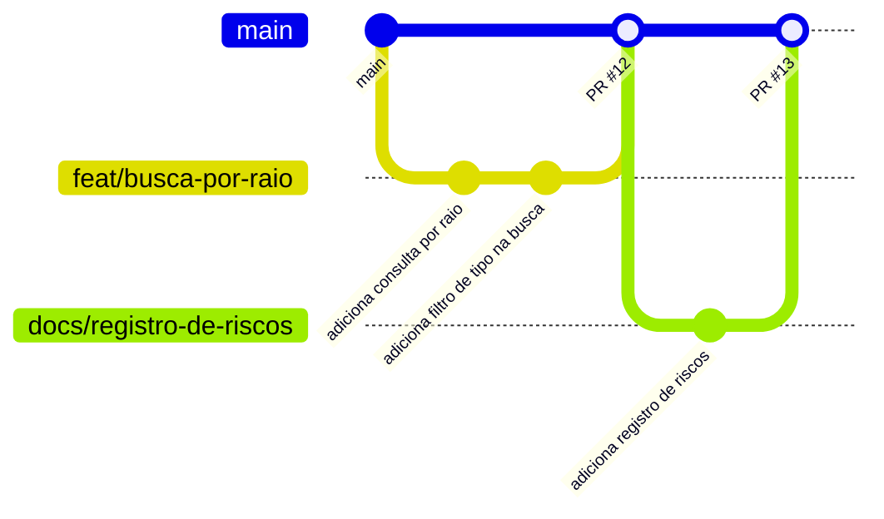

# 06 — Versionamento

Como o grupo usa Git e GitHub no LocalizaPet. O repositório é **público** —
o que entra aqui fica visível para sempre, inclusive o que for removido em
commit posterior.

## Fluxo



1. Issue no GitHub, com horas previstas
2. Branch a partir da `main` atualizada
3. Commits pequenos, em português, no imperativo
4. Pull request → preview automático da Vercel
5. Revisão de outra pessoa do grupo
6. Merge na `main`, branch apagada
7. Issue fechada com as horas realizadas preenchidas

Ninguém commita direto na `main`.

---

## Branches

### Nome

```
<tipo>/<descricao-curta-em-kebab-case>
```

| Tipo | Quando usar |
|---|---|
| `feat/` | Funcionalidade nova |
| `fix/` | Correção de defeito |
| `docs/` | Só documentação |
| `chore/` | Configuração, dependência, estrutura — nada que o usuário veja |

Exemplos:

```
feat/busca-por-raio
feat/cadastro-de-caracteristicas
fix/telefone-aparecendo-sem-autorizacao
docs/registro-de-riscos
chore/configuracao-do-eslint
```

Sem acento e sem `_`. A descrição diz **o que muda**, não quem faz nem o
número da issue — isso já está no PR.

Se o grupo precisar de um tipo novo (`refactor/`, `test/`), a decisão é do
grupo e este documento é atualizado junto. Quatro prefixos que todos usam
valem mais que oito que cada um interpreta de um jeito.

### Regras

- **Uma branch por issue.** Branch que resolve três coisas gera PR que
  ninguém revisa direito
- **Sempre a partir da `main` atualizada** (`git switch main && git pull`)
- **Vida curta.** Quanto mais tempo aberta, pior o conflito no merge
- **Apagada depois do merge.** O histórico fica no PR

---

## Commits

### Formato

```
<verbo no imperativo> <o que muda>
```

Em português, minúscula, sem ponto final, até 72 caracteres no assunto.

| Bom | Ruim | Por quê |
|---|---|---|
| `adiciona filtro por espécie` | `adicionado filtro por espécie` | Passado, não imperativo |
| `corrige raio ignorado na busca` | `correções` | Não diz o que mudou |
| `remove telefone da resposta pública` | `Remove Telefone Da Resposta Pública.` | Maiúsculas e ponto final |
| `adiciona tabela de notificações` | `wip` | Não descreve nada |

**Não usamos Conventional Commits.** Nada de `feat:` ou `fix:` na mensagem —
o tipo vive no nome da branch. Misturar os dois é redundante.

### Corpo

Assunto diz **o que**. Corpo, quando existir, diz **por quê** — nunca *como*,
porque o *como* está no diff.

```
usa o pooler na connection string

A string direta funciona em desenvolvimento e derruba conexões quando
algumas requisições chegam juntas. Ver DT-02.
```

### Tamanho

Um commit, uma ideia. Se a mensagem precisa de "e" para descrever o que faz,
provavelmente são dois commits.

Commit que muda schema, API e interface de uma vez não pode ser revertido em
partes — e é sempre uma parte que dá problema.

---

## Pull request

### Abertura

- **Título**: mesma regra do commit — imperativo, em português
- **Corpo**: o que muda, por que, e como testar no preview
- **`Closes #N`** no corpo, para a issue fechar no merge
- Um revisor do grupo, que não seja quem escreveu

### Checklist antes de abrir

- [ ] Nenhuma credencial no diff — o repositório é público
- [ ] `.env` não aparece em `git status`
- [ ] Documentação atualizada, se a mudança afeta requisito, regra ou schema
- [ ] Horas realizadas anotadas para o fechamento da issue

### Revisão

Toda mudança passa por outra pessoa. Não é formalidade: é o que faz mais de
uma pessoa conhecer cada parte do sistema — e a disciplina avalia isso.

O preview da Vercel sobe automaticamente. Revisar pelo preview, não só pelo
diff.

### Merge

Merge só depois de aprovado. Branch apagada em seguida.

---

## Coordenação de schema

Mudança de schema é coordenada pelo **Responsável por Configuração**.

Duas pessoas criando a migration de mesmo número ao mesmo tempo gera
conflito que o Git não resolve sozinho: os dois arquivos existem, os dois
parecem certos, e o banco de quem aplicou o primeiro fica diferente do banco
de quem aplicou o segundo.

Antes de criar migration, avise o responsável e confirme qual é o próximo
número livre.

Ver [04 — Modelo de dados](04-modelo-dados.md#evolução-do-schema).

---

## O que nunca entra no repositório

O repositório é público (RNF-02).

| Nunca | Em vez disso |
|---|---|
| `.env` com valores reais | `.env.example` com os campos vazios |
| Connection string, token, chave de API | Variável de ambiente, cadastrada no painel do serviço |
| `node_modules/`, `.next/` | `.gitignore` |

**Credencial commitada é credencial vazada.** Remover em commit posterior não
resolve: ela continua no histórico, e o repositório é público. O
procedimento é revogar a credencial no serviço e gerar outra.

---

## Registro de horas

Toda tarefa tem issue com **horas previstas** registradas na abertura e
**horas realizadas** no fechamento.

Esse registro alimenta o burndown e o EVM exigidos pela disciplina, então não
pode ser deixado para depois — reconstituir horas no fim do projeto produz
número inventado, e isso aparece.

---

## Documentos relacionados

- [04 — Modelo de dados](04-modelo-dados.md) — evolução do schema
- [05 — Arquitetura](05-arquitetura.md) — preview automático da Vercel
